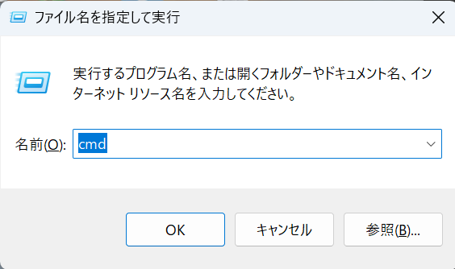
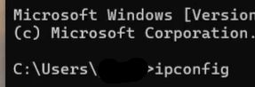

# IPアドレスの確認の仕方
**RemoteView**でライセンスサーバーを持つPCにアクセスします。 

**Win+Rキー**を押して、出てきたダイアログに**cmd**と入力します。 
 
もしくは検索欄にcmdと入力 
 

表示されたコマンドプロンプトに**ipconfig**と入力しEnterキーを押します 
 
スクロールしていくと**IPv4アドレス**があるのでそれをコピーすればOKです。 
 