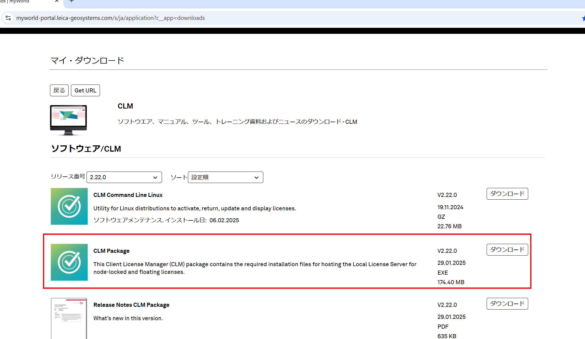
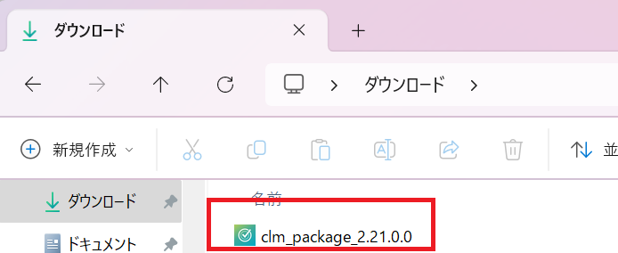
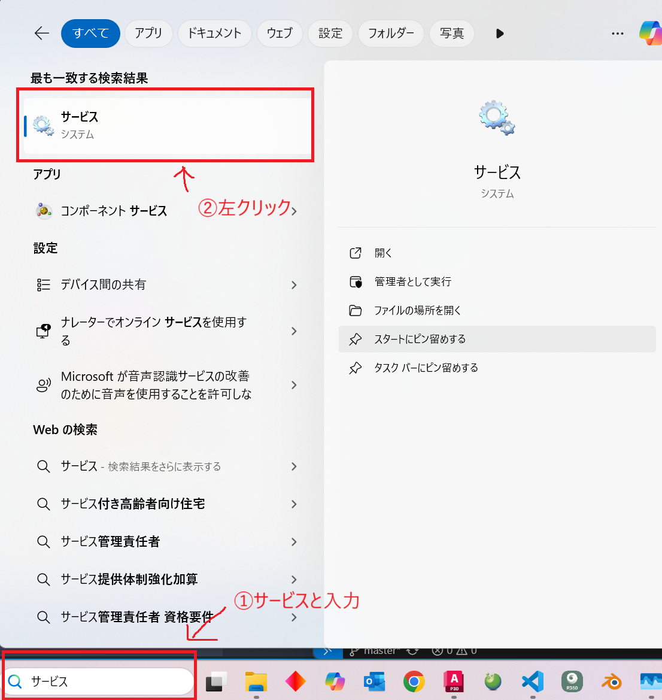
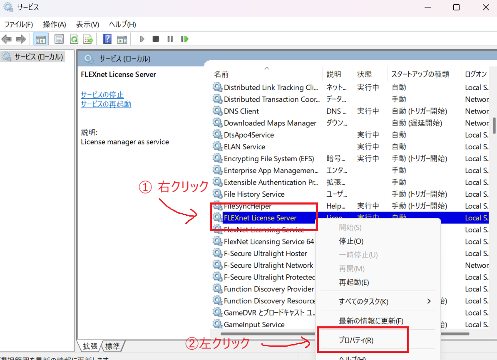
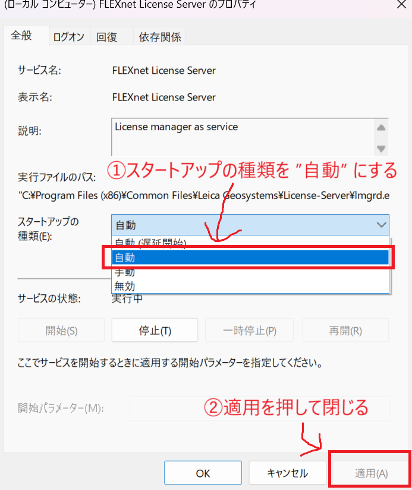
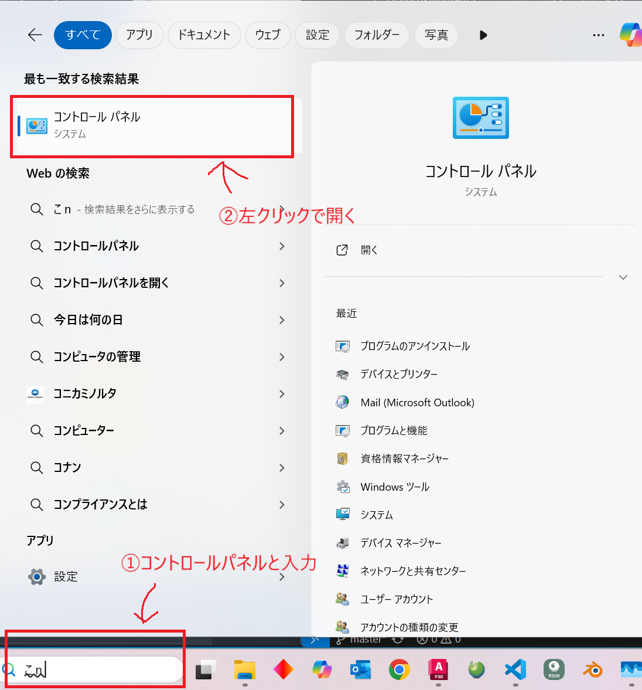
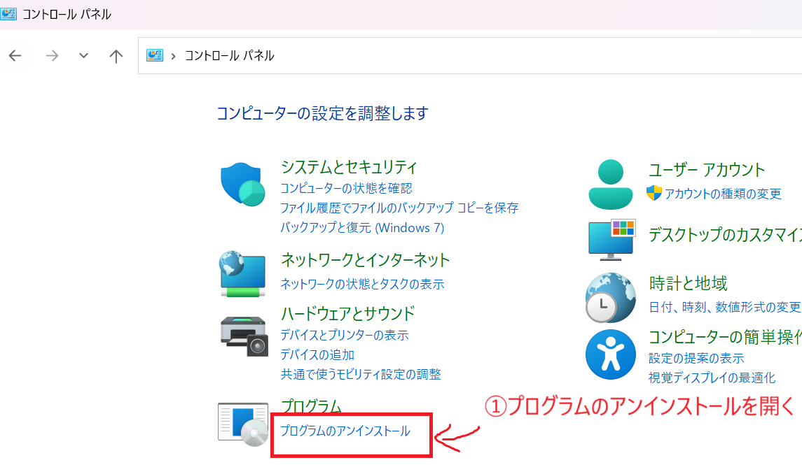
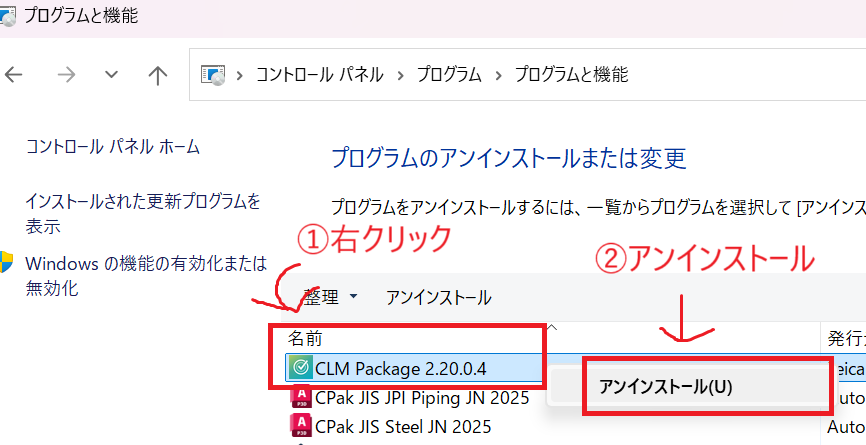
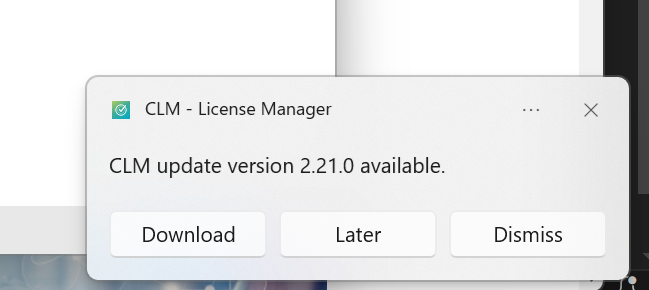

# CLM

## CLMのダウンロード
LeicaのmyWorldから**CLM Package**をダウンロードします。 
https://myworld-portal.leica-geosystems.com/s/ja/application?c__app=downloads 
 

ダウンロード後、ダウロードフォルダにある**clm_package_X.XX**を実行しインストールを行ってください。 
 

## ダウンロード後にやること(重要)
**Windows**の検索欄に**サービス**と入力 
 

**FLEXnet License Server**を右クリック 
プロパティを開く 
 

スタートアップの種類が自動(遅延開始)になっていると思うので、**自動**を選択して**適用**をクリック 
 

## ダウンロード後にやることを忘れた場合(重要)
**Windows**の検索欄に**コントロールパネル**と入力 
 
**プログラムのアンインストール**を開く 
 

一度 **CLM**をアンインストールします。 
 

## CLMのアップデート
起動時に右下に表示されるダイアログからダウンロード。 
 

### 重要！！！！！
**アップデートしたあとにも[ダウンロード後にやること](#ダウンロード後にやること重要)の手順を行うこと。**