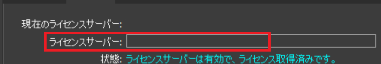

# Cyclone REGISTER 360 PLUSをクライアント機から使用する方法
起動時に表示されるダイアログの**ServerName**に、ライセンスサーバーを持つPCのIPアドレスを入力する。 
[IPアドレスの確認の仕方](../General/HowToShowIP.md) 
 

入力したらOKを押すだけ！ 

# 注意！！！！
現在(2025/01/16)ライセンスが一つしかないため、他のPCで使用している場合、クライアント機から使うことができません。 
また、クライアント機から使用中の場合は、他のPCで使うことができません。 
**使い終わった場合、もしくは長時間席を離れる場合は、作業を保存してからソフトを閉じて下さい。**
